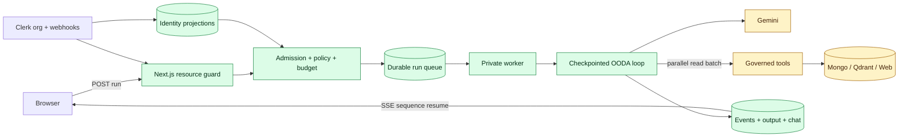
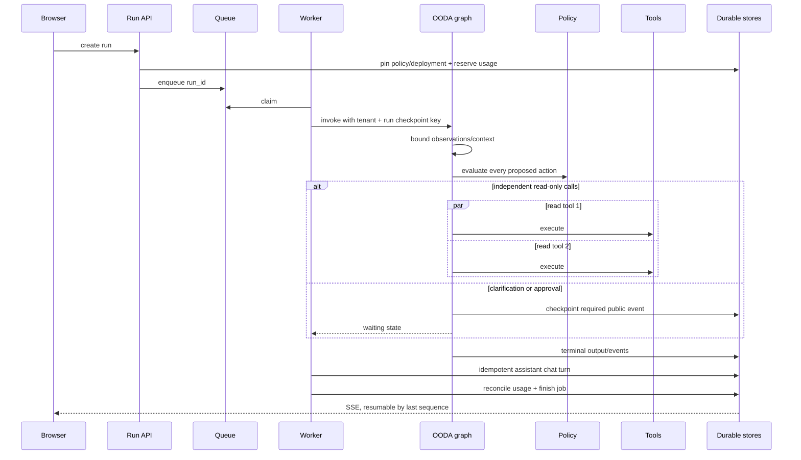

# Architecture drill-down and 20-flow closure

This is the closure companion to
`2026-07-30-e2e-sweep-findings.json`. “Code-verified” means an executable
repository test covers the repaired production boundary. It does not claim a
new production deployment or a live Clerk/provider smoke.

## Macro image — where latency and failures accumulated

The original symptom (“AI is slow/poor”) was an amplification chain:
unbounded repeated context increased model latency; read tools ran
sequentially; queue/model/tool/persistence time was not separated; completed
answers were not durable chat turns; interrupt events never reached the UI;
and a failed EventSource reconnect could leave a completed run looking hung.

## Micro image — one governed turn

## Closure matrix

| # | Production flow | Disposition | Repository evidence / remaining boundary |
|---:|---|---|---|
| 1 | Browser SSE + reconnect | Code-verified | Exact route bypasses Clerk redirects but retains resource authorization; explicit sequence resume/backoff and delivery telemetry are tested. Cloudflare/nginx still needs post-deploy smoke. |
| 2 | Clarification resume | Code-verified | Required event is checkpointed before interrupt; executor fails closed if absent; restart/resume tests cover the graph contract. |
| 3 | Manager approval | Code-verified | Approval event is checkpointed before interrupt, manager role is no longer hard-coded, and commit remains policy/approval gated. |
| 4 | Artifact auto-populate | Code-verified | Form consumes terminal-output artifacts as well as incremental events and fetches the guarded artifact. |
| 5 | Same-thread follow-up | Code-verified | Checkpoints are tenant+run isolated; completed answers are idempotently persisted into the shared conversation. |
| 6 | Legacy executor pin | Code-verified rollback only | Full admission → authorization → compatibility execution → schema → usage reconciliation test added. A latent invalid output enum was found and fixed. |
| 7 | Legacy HTTP AI endpoints | Retired | Authenticated handlers return 410; shipping pages use governed runs/feedback. |
| 8 | Invitation accept / allowlist | Code-verified | Invitee is allowlisted before restricted-mode invitation; duplicate handling is narrow and tested. Live Clerk acceptance remains an external smoke. |
| 9 | Membership webhook | Code-verified | Missing dependencies fail the receipt for retry instead of acknowledging data loss; replay test covers recovery. Live Svix delivery remains external. |
| 10 | Multi-org switch | Code-verified | UI blocks, cancels queries, waits until the server-visible Clerk org matches, then clears/refetches. |
| 11 | Suspend/reactivate/remove | Code-verified application boundary | Manual suspension is recorded as authoritative so a later Clerk sync cannot silently reactivate it. Live Clerk mutation remains external. |
| 12 | Appoint/demote manager | Code-verified application boundary | Last-manager invariant and Clerk role mapping are covered; live Clerk mutation remains external. |
| 13 | Onboarding states | Code-verified | Public routing now passes through Clerk middleware so server `auth()` is populated; state rendering tests remain green. |
| 14 | Imported formulas list | Code-verified | Imported shapes are normalized into canonical formula fields. |
| 15 | Save AI formula artifact | Code-verified | Artifact → form → create accepts normalized/nonnegative ingredient amounts and mixed collection shapes. |
| 16 | 3,049-product picker | Code-verified | Server-side search replaces the first-1,000 client cap. |
| 17 | Products/ingredients pages | Code-verified | CAS enrichment uses the actual `inci_reference` import collection; pagination/search remains tenant scoped. |
| 18 | Knowledge upload | Safely disabled | Both entry points fail closed unless `KNOWLEDGE_UPLOAD_PIPELINE_ENABLED=true`; no source is stranded by a fake-success path. A real object-store consumer is a separate feature, not claimed complete. |
| 19 | Admin credits | Code-verified | Clerk-era profiles/memberships and tenant `creditBalance` are canonical. Add, adjust, and deduct now use the same tenant ledger. |
| 20 | Clerk reconciliation CLI | Code-verified/operator-ready | Missing/contradictory/orphan/malformed cases are tested; active orphan projections are revoked; built CLI is included in the worker image. Live Clerk run remains an operator smoke. |

## Remaining performance limits, explicitly not hidden

- Provider latency and external search/vector latency remain workload-dependent;
  boundary telemetry now separates them.
- Explicit Gemini cached-content was not enabled: stable system prefixes can
  receive provider implicit caching, while explicit caches impose model token
  minimums and storage cost. Context bounding removes the pathological growth
  regardless of cache eligibility.
- The legacy rollback executor still performs its legacy RAG behavior. It is
  retained only as a pinned rollback path, not as the preferred performance
  architecture.
- Items requiring Cloudflare/nginx, live Clerk, Svix, Gemini, Qdrant, or a
  deployed database must be smoke-tested after deployment; repository tests
  cannot honestly certify those external systems.
